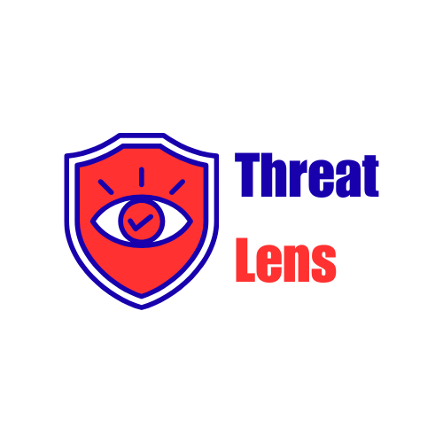

# Find the Latest Cybersecurity News from Trusted Sources, Within one Click! - ThreatLens

This is a modern web application that fetches and displays the latest cybersecurity news from various trusted sources. Built with Next.js and Tailwind CSS.

<p align="center">
  
</p>

## What does ThreatLens offer?

- Real-time fetching of cybersecurity news from multiple sources
(such as THN, Dark Reading, Bleeping Computer, CISA, etc..)
- Responsive grid layout for news articles
- Server-side API route for fetching news

## Getting Started

You can access the live project here: [ThreatLens](https://threatlens-news.vercel.app/)

1. Clone the repository:
```bash
git clone https://github.com/SiddDevCS/ThreatLens
cd cybernews-web
```

2. Install dependencies:
```bash
npm install
```

3. Run the development server:
```bash
npm run dev
```

4. Open [http://localhost:3000](http://localhost:3000) in your browser.

## Project Structure

```
src/
├── app/
│   ├── api/
│   │   └── news/
│   │       └── route.ts    # API route for fetching news
│   └── page.tsx            # Main page component
├── components/
│   ├── LoadingSpinner.tsx  # Loading spinner component
│   └── NewsList.tsx        # News list component
├── lib/
│   ├── news-fetcher.ts     # News fetching logic
│   └── news-sources.ts     # News sources configuration
└── types/
    └── news.ts            # TypeScript type definitions
```

## Contributing

1. Fork the repository
2. Create your feature branch (`git checkout -b feature/amazing-feature`)
3. Commit your changes (`git commit -m 'Add some amazing feature'`)
4. Push to the branch (`git push origin feature/amazing-feature`)
5. Open a Pull Request

## License

This project is licensed under the MIT License - see the LICENSE file for details.
